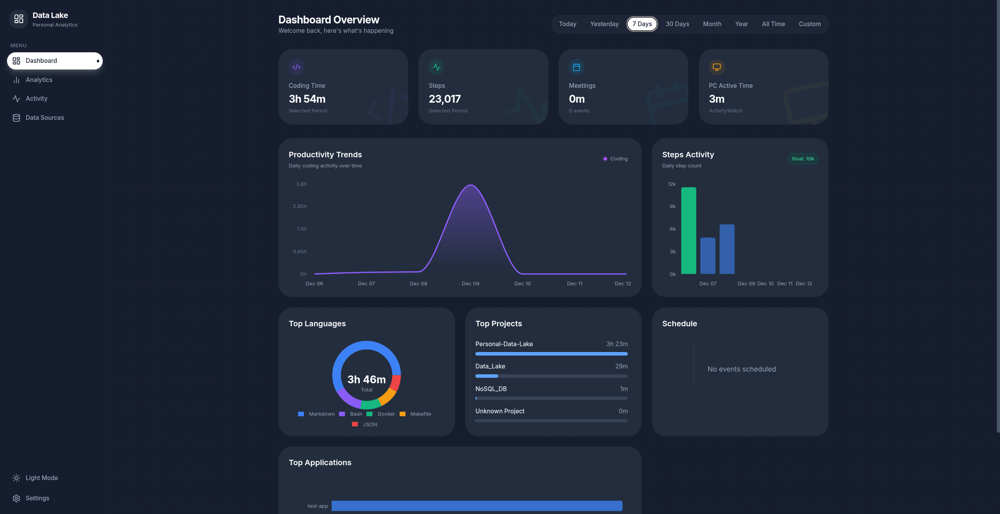
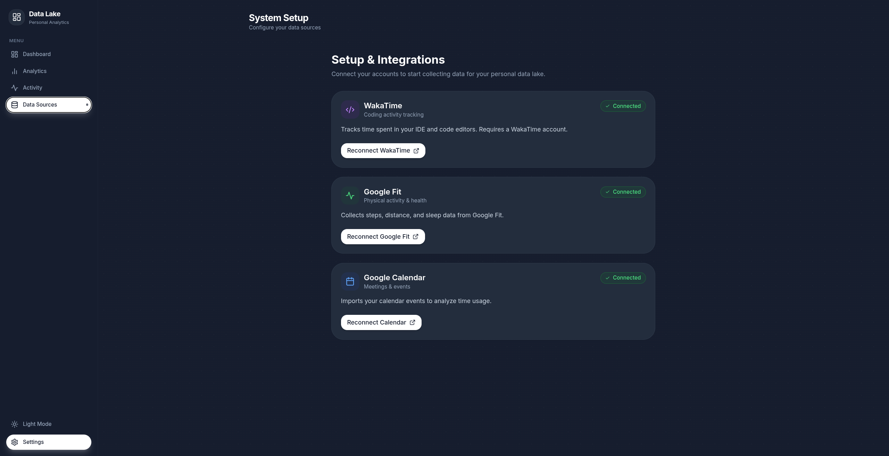
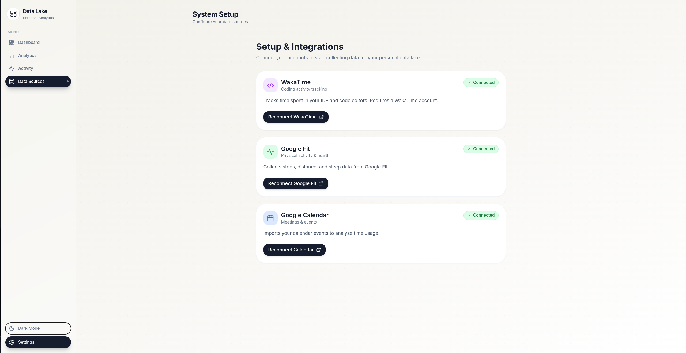
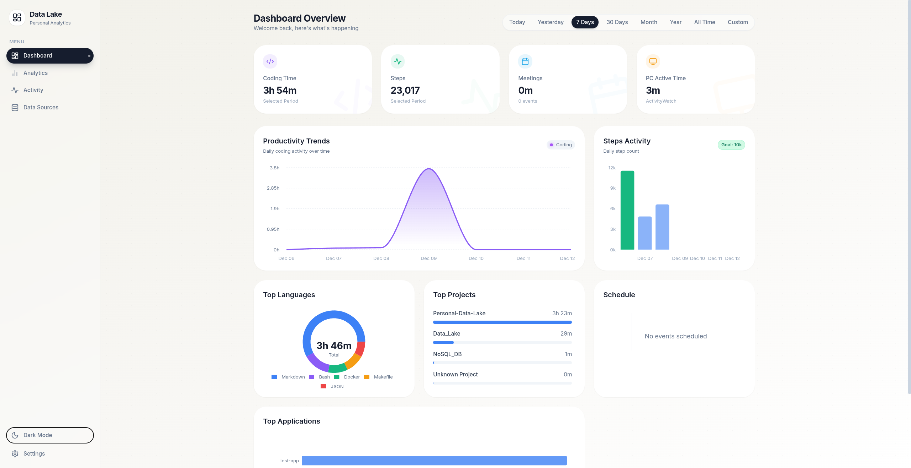
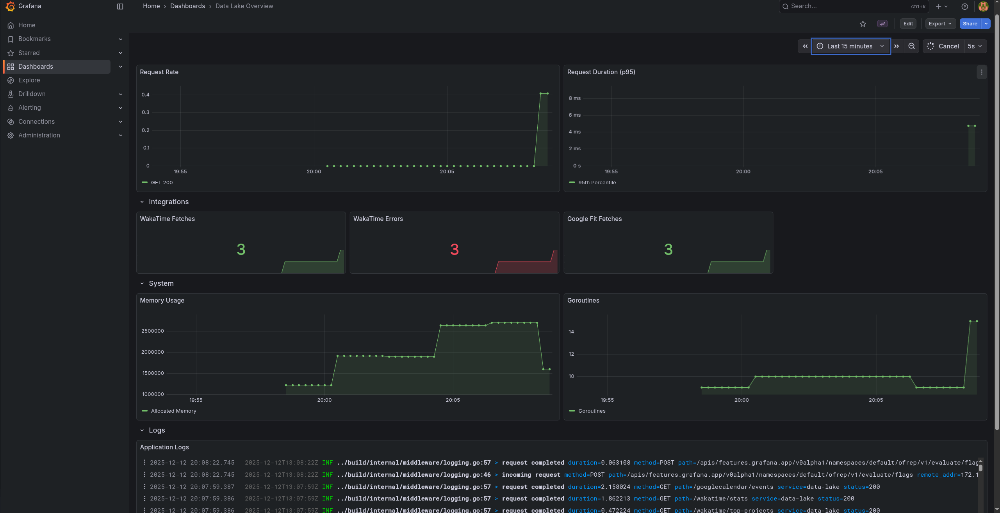

# 📊 Personal Data Lake

> Self-hosted платформа для сбора и анализа персональной продуктивности с современным веб-интерфейсом


[](https://golang.org)
[](https://reactjs.org)
[](https://postgresql.org)
[](https://docker.com)
[](https://grafana.com/)
[](https://prometheus.io/)
[](https://grafana.com/oss/loki/)
[](https://github.com/Narotan/Personal-Data-Lake/actions)
[](docs/LICENSE)


---

## 🎯 О проекте

**Personal Data Lake** - это self-hosted решение для автоматического сбора и визуализации данных о персональной продуктивности. Приложение собирает данные из различных источников, хранит их локально в PostgreSQL и предоставляет современный интерфейс для просмотра и анализа.

### ✨ Функционал

- 📊 **Интерактивный Dashboard** - графики, KPI
- 🔄 **Автоматический сбор** - данные собираются каждые 5 минут (можно легко настроить в scheduler/scheduler.go)
- 🎨 **Адаптивная визуализация** - месячная агрегация для больших периодов
- 🔐 **Полная приватность** - все данные хранятся локально
- 🚀 **Быстрый старт** - запуск одной командой через Docker
- 📈 **Мониторинг** - Prometheus + Grafana из коробки

### 📦 Источники данных

| Сервис | Что собирается |
|--------|----------------|
| 💻 **WakaTime** | Время кодирования, языки, проекты 
| 🏃 **Google Fit** | Шаги, дистанция, физическая активность 
| 📅 **Google Calendar** | События, встречи, расписание 
| 🖥️ **ActivityWatch** | Активность на компьютере, приложения
---

## ⚡ Быстрый старт

```bash
# 1. Клонировать репозиторий
git clone https://github.com/Narotan/Personal-Data-Lake.git
cd Personal-Data-Lake

# 2. Настроить проект (создаст .env файлы)
make setup

# 3. Добавить OAuth секреты и API ключи в .env
nano .env
# Укажите:
# - API_KEY=<openssl rand -hex 32>
# - API_USER_ID=<uuidgen>
# - OAuth credentials для WakaTime, Google Fit, Google Calendar

# 4. Запустить все сервисы
make start
```

### Основные команды

```bash
make start      # Запустить все сервисы
make stop       # Остановить все сервисы
make restart    # Перезапустить
make logs       # Показать логи всех сервисов
make clean      # Удалить все данные и контейнеры
```
---

### Работа с Docker контейнерами

```bash
# Логи конкретного сервиса
docker logs -f datalake_app           # Backend
docker logs -f datalake_frontend      # Frontend
docker logs -f datalake_nginx         # Nginx
docker logs -f datalake_postgres      # PostgreSQL

```

---
### ActivityWatch

Для сбора данных активности на компьютере:


```bash
make build-aw   # Собрать клиент
make run-aw     # Запустить сбор данных (последний час)
```
> ActivityWatch должен быть установлен и запущен на вашем компьютере.  
> Возможны проблемы если вы используете Wayland так как он не дает нормально трекать окна в системе


**📖 Подробная документация по установке:** [docs/QUICKSTART.md](docs/QUICKSTART.md)

## 📸 Демонстрация

### Dashboard - Главная страница


*Интерактивный dashboard с KPI метриками, графиками продуктивности и активности*


*Страница с сервисами котоыре можно подключить*


*Страница с сервисами котоыре можно подключить*


*Интерактивный dashboard с KPI метриками, графиками продуктивности и активности*


### Мониторинг и метрики


*Мониторинг системы через Grafana с метриками Prometheus*

---

## 📊 Web Dashboard

### Доступ к интерфейсу (через ngnix и напрямую)

- **frontend:** http://localhost:8000 или http://localhost/
- **Backend API:** http://localhost/api/ или http://localhost:8080/api/
- **Grafana:** http://localhost/grafana/ или http://localhost:3000
- **Prometheus:** http://localhost/prometheus/ или http://localhost:9090

### Возможности интерфейса

- **KPI Карточки** - мгновенная статистика за выбранный период
- **Графики продуктивности** - визуализация времени кодирования
- **График активности** - отслеживание шагов с целями
- **Топ языков** - круговая диаграмма с процентами
- **Топ проектов** - прогресс-бары по времени работы
- **Топ приложений** - анализ использования ПК
- **Timeline расписания** - события календаря в удобном виде

### Периоды анализа

- Today / Yesterday
- Last 7 / 30 Days
- Current Month
- **Last Year** (автоматическая агрегация по месяцам)
- **All Time** (автоматическая агрегация по месяцам)
- Custom Range (произвольный период)

### Умная агрегация

- **≤ 90 дней** → дневные данные для детального анализа
- **> 90 дней** → месячная агрегация для обзора трендов

---

## 🛠 Технологии

### Frontend
```
React 18 + TypeScript + Vite
TailwindCSS + Framer Motion
Recharts + date-fns
```

### Backend
```
Go 1.24 + net/http
SQLC (type-safe SQL)
zerolog + Prometheus
```

### Infrastructure
```
PostgreSQL 15
Docker + Docker Compose
Nginx (Reverse Proxy на порту 80)
Grafana + Prometheus + Loki + Promtail
```
---

## 🏗 Архитектура проекта

### 📁 Структура Backend

```
.
├── cmd/                    # Точки входа приложений
│   ├── main.go            # Основной сервер
│   ├── aw-client/         # Клиент ActivityWatch
│   └── test-api/          # Тестовый клиент API
│
├── api/v1/                # REST API
│   ├── router.go          # Маршрутизация API
│   ├── handlers/          # HTTP обработчики
│   │   ├── activitywatch.go
│   │   ├── googlecalendar.go
│   │   ├── googlefit.go
│   │   └── wakatime.go
│   └── models/            # API модели
│
├── server/                # HTTP сервер
│   ├── server.go          # Конфигурация сервера
│   ├── routes.go          # Общие маршруты
│   └── handlers/          # Обработчики (auth, callbacks)
│
├── auth/                  # OAuth 2.0 и безопасность
│   ├── provider.go        # Базовый провайдер
│   ├── token_manager.go   # Управление токенами
│   ├── storage.go         # Хранение токенов (tokens.json)
│   ├── encryption.go      # AES-256-GCM шифрование токенов
│   ├── googlecalendar/
│   ├── googlefit/
│   └── wakatime/
│
├── db/                    # База данных
│   ├── db.go              # Подключение к PostgreSQL
│   ├── migrations/        # Миграции схемы
│   ├── schema/            # DDL определения таблиц
│   ├── queries/           # SQL запросы для SQLC
│   └── views/             # SQL представления
│
├── internal/db/           # Генерируемый SQLC код
│   ├── store.go           # Общий интерфейс хранилища
│   ├── activitywatch/     # Queries для ActivityWatch
│   ├── googlecalendar/    # Queries для Google Calendar
│   ├── googlefit/         # Queries для Google Fit
│   └── wakatime/          # Queries для WakaTime
│
├── scheduler/             # Cron задачи
│   └── scheduler.go       # Периодический сбор данных
│
├── internal/
│   ├── logger/            # Структурированное логирование
│   ├── metrics/           # Prometheus метрики
│   └── middleware/        # HTTP middleware
│
├── wakatime/              # Интеграция WakaTime
├── googlefit/             # Интеграция Google Fit
├── googlecalendar/        # Интеграция Google Calendar
│
├── nginx/                 # Reverse Proxy конфигурация
│   ├── nginx.conf         # Основные настройки
│   └── conf.d/
│       └── default.conf   # Маршрутизация и upstream'ы
│
└── monitoring/            # мониторинг
    ├── prometheus.yml
    ├── loki-config.yml
    └── grafana/
```

#### 🔄 Поток данных Backend

1. **Scheduler** → запускает сбор каждые 5 минут
2. **API Clients** (wakatime, googlefit, googlecalendar) → получают данные из внешних API
3. **SQLC Stores** → сохраняют в PostgreSQL с type-safety
4. **REST API** → обслуживает запросы фронтенда
5. **Middleware** → логирование, метрики, авторизация

### 📁 Структура Frontend

```
web/
├── src/
│   ├── main.tsx           # Точка входа
│   ├── App.tsx            # Корневой компонент
│   │
│   ├── components/        # React компоненты
│   │   ├── dashboard/             # Dashboard компоненты
│   │   │   ├── KPICard.tsx
│   │   │   ├── ProductivityChart.tsx
│   │   │   ├── HealthChart.tsx
│   │   │   ├── LanguageDistribution.tsx
│   │   │   ├── TopProjects.tsx
│   │   │   ├── TopApplications.tsx
│   │   │   └── ScheduleTimeline.tsx
│   │   ├── layout/                # Layout компоненты
│   │   │   ├── Header.tsx
│   │   │   └── Sidebar.tsx
│   │   ├── ui/                    # UI примитивы
│   │   │   ├── Button.tsx
│   │   │   ├── Card.tsx
│   │   │   └── Skeleton.tsx
│   │   ├── Setup.tsx              # Страница настройки OAuth
│   │   └── AuthSuccess.tsx        # Страница успешной авторизации
│   │
│   ├── lib/               # Утилиты
│   │   ├── api.ts                 # API клиент (axios)
│   │   ├── utils.ts               # Общие утилиты
│   │   └── theme.tsx              # Тема приложения
│   │
│   └── index.css          # Глобальные стили
│
├── Dockerfile             # Docker образ для frontend (Node 20)
├── index.html             # HTML шаблон
├── setup.html             # HTML для страницы Setup
├── vite.config.ts         # Vite конфигурация
├── tailwind.config.js     # TailwindCSS конфигурация
├── tsconfig.json          # TypeScript конфигурация
└── package.json           # Зависимости
```

### 🚀 Развёртывание Frontend

Frontend автоматически запускается в Docker контейнере:
- **Порт:** 8000 (прямой доступ) или 80 через Nginx
- **Автоустановка зависимостей:** npm install выполняется при старте контейнера
- **Docker образ:** node:20-alpine с минимальным размером

#### 🎨 Архитектура Frontend

- **React 18** с TypeScript для type-safety
- **Vite** для быстрой разработки и сборки
- **TailwindCSS** для стилизации
- **Recharts** для интерактивных графиков
- **Framer Motion** для плавных анимаций
- **date-fns** для работы с датами


## 🔒 Безопасность

Personal Data Lake реализует некоторые практики информационной безопасности:

- 🔐 **AES-256-GCM шифрование** - все OAuth токены зашифрованы перед сохранением
- 🌐 **CORS** - контроль доступа с разрешенных доменов
- 👤 **Непривилегированный пользователь** - Docker контейнер работает без root
- 🔑 **Переменные окружения** - все секреты в ENV, без хардкода
- 📊 **Аудит** - структурированное логирование всех операций
- 🔒 **Security Headers** - X-Frame-Options, X-Content-Type-Options, XSS Protection
- 🗜️ **Gzip Compression** - сжатие трафика для оптимизации

### Быстрая настройка безопасности (env)

```bash
# 1. Сгенерировать ключ шифрования (32 символа для AES-256)
openssl rand -base64 32 | cut -c1-32

# 2. Добавить в .env
ENCRYPTION_KEY=ваш-32-символьный-ключ

# 3. Настроить CORS для продакшена
ALLOWED_ORIGINS=https://yourdomain.com

# 4. Настроить Rate Limiting
RATE_LIMIT_RPS=10
RATE_LIMIT_BURST=20
```

## 📚 Документация

- 📖 [Быстрый старт](docs/QUICKSTART.md) - подробная инструкция по установке
- 🌐 [Nginx конфигурация](docs/NGINX.md) - настройка reverse proxy, SSL, rate limiting
- 🖥️ [ActivityWatch интеграция](docs/ACTIVITYWATCH.md) - сбор данных активности
- 🔌 [API документация](docs/API.md) - REST API endpoints

---

## 📄 Лицензия

Проект распространяется под лицензией MIT. Подробности в файле [LICENSE](docs/LICENSE).

---
